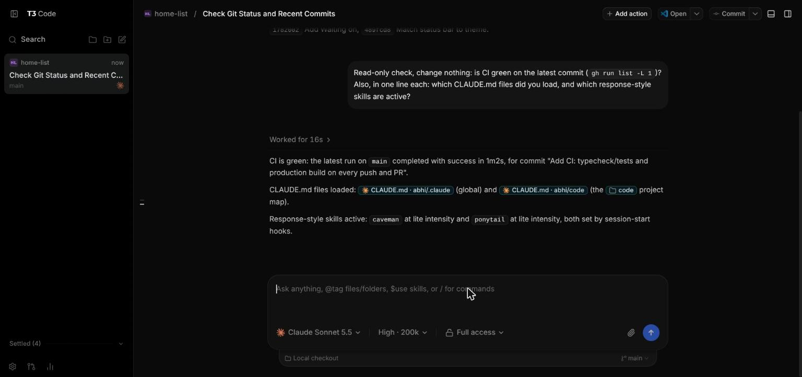

# AI Workbench

## Start here: paste this to your agent

On a fresh Ubuntu machine, first run `sudo apt install -y curl git` and install
Claude Code (`curl -fsSL https://claude.ai/install.sh | bash`, then run `claude` once
to sign in). Then paste this into Claude Code, or into any coding agent:

```text
Set up this Linux machine with AI Workbench (https://github.com/abhibansal60/ai-workbench).
1. Clone it to ~/code/ai-workbench, or run `git pull` there if it already exists.
2. Read ~/code/ai-workbench/.claude/skills/ai-workbench/SKILL.md in full and follow it
   as the runbook. Start with Step 0: detect my environment with read-only commands and
   sort out the prerequisites.
3. Ask me which components I want before you install anything, and install only those.
   Read every existing dotfile before you change it.
4. Never run sudo yourself. When a step needs root, give me the exact command and wait.
5. Verify each step as the runbook says. Finish by running ai-workbench-doctor and tell
   me what passed, what needs a new terminal, and what is left for me to do (for example
   gh auth login, or pairing my phone with T3 Code).
```

A Claude Code **skill** that builds a cohesive matrix-green / cyber-purple developer
environment on Linux — one shared color palette across your prompt, terminal, editor,
system monitor, and diffs, instead of eleven mismatched default themes.

> Formerly `cyberdeck-setup`. Renamed throughout — GitHub repo, skill folder,
> `SKILL.md`'s internal name, and every asset filename/identifier.

The core tools install to `~/.local`. No `sudo`, no `apt install`, no `snap` — every tool
is fetched as a portable binary/tarball from its own releases page (the clipboard tools
are unpacked from Ubuntu's `.deb`s without root), so this works identically whether or
not you have root on the machine. The optional host pieces (Tailscale, always-on,
voice typing, the Remmina client) need root; the agent gives you those commands to run
instead of running them.

## What it sets up

| Component | What you get |
|---|---|
| VS Code | Portable install + desktop launcher |
| Starship | Two-line prompt: directory, git branch/status, language runtimes, conda, cmd duration |
| Nerd Font | Correctly-metriced (readable) icon font — the naive "Mono" patch variant is broken in VTE terminals, this skill knows to avoid it |
| Terminal palette | Full 16-color ANSI theme (Ptyxis: automated; other terminals: palette file + manual pointer) |
| Claude Code status line | Themed status line inside Claude Code: context, 5h and 7-day limit bars, session token totals |
| Usage hard stop | Optional: a hook that stops Claude at 75% of the 5-hour limit, so one long run can't use up the window |
| eza / bat / fzf / zoxide | Modern `ls`/`cat`/history-search/`cd` replacements |
| git delta | Side-by-side, syntax-highlighted diffs in the same palette |
| zellij | Themed terminal multiplexer |
| btop | Themed system monitor |
| bash aliases | Claude Code, Codex, Git, Docker, Python, Node and navigation shortcuts, plus a `dh` command that prints all of them |
| GitHub CLI | Installed and ready for you to run `gh auth login` (this one step stays manual, on purpose) |
| Node.js | LTS tarball, checksum-verified. Status-line token totals, the daily.dev status line, `npx` and some plugins need it |
| Clipboard tools | `wl-clipboard` + `xclip`, so Claude Code can paste images on Linux, plus `pbcopy`/`pbpaste` |
| Claude Code plugins | Optional: `mattpocock-skills`, `daily.dev`, `ponytail`, `caveman`, `humanizer` — pick any subset |
| Tailscale | Optional hand-off: the skill checks it and gives you the install + `sudo tailscale up` commands (needs root, so it never runs them). Lets your phone reach this box |
| T3 Code | Optional: [t3.codes](https://t3.codes) as a background service on your tailnet, so your phone can run Claude sessions on this box. Telemetry off, Claude as default, restarts itself after a crash, optional HTTPS through Tailscale Serve |
| Two machines | `t3-sync-update` puts every machine's T3 server on the same release and checks they match (the phone app refuses an older server). A systemd timer on the always-on machine does it daily at 04:00 |
| Clean dock | Optional, GNOME: only the terminal and the browser stay pinned |
| Always-on host | Optional: no sleep on AC, lid close ignored, sleep masked so nothing can suspend it, Wi-Fi before login, plus the BIOS battery and power-on settings to make — for a box you reach over Tailscale/T3 |
| Voice typing | Optional, needs root for the install: [Handy](https://github.com/cjpais/Handy) with NVIDIA's Parakeet model, fully offline, one GNOME shortcut, pastes into T3 or any app |
| Remote desktop | Optional: GNOME Desktop Sharing on one machine, a saved Remmina connection on the other that unlocks the screen before it connects |
| `ai-workbench-doctor` | Always installed — a `doctor` command that reports what's actually configured vs missing |

## Screenshot


Themed status line: directory, git branch, model, context-usage bar, and the
Claude.ai 5-hour rate-limit bar — all in the matrix-green / cyber-purple palette.



T3 Code driving Claude Code on the same box, with the global `CLAUDE.md` and skills loaded.

## Using it

Use the **Start here** prompt above. The agent clones the repo, follows
[`SKILL.md`](.claude/skills/ai-workbench/SKILL.md) as its runbook, asks which pieces you
want, and verifies each one. Run it again any time: it reads what's already set up and
only fills the gaps. `doctor` shows the current state.

To use it only as a Claude Code skill, copy `.claude/skills/ai-workbench/` into
`~/.claude/skills/` and ask Claude to set up the AI Workbench.

### Moving to a new machine

Put both machines on the same tailnet, then follow **Moving from another machine** in
`SKILL.md`: your agent copies `~/code` and `~/.claude` across with rsync (skipping
`node_modules` and caches), leaves logins for you to redo, and then runs the normal
setup to fill the gaps.

## Why a skill and not a script

A shell script either overwrites your existing `~/.bashrc`/`~/.gitconfig` or gets
complicated fast trying not to. A Claude Code skill can actually *read* your existing
config first, detect which terminal you're running, adapt the handful of
terminal-specific steps (font/palette wiring) to what it finds, and explain what it's
about to do at each step — which is what this setup actually needs, since half the
components here (Ptyxis palette wiring, Nerd Font variant selection) have sharp edges
that a fixed script can't safely special-case for every environment.

## Structure

```
.claude/skills/ai-workbench/
├── SKILL.md              # the runbook Claude follows
└── assets/                # tested, ready-to-copy config templates
    ├── starship.toml
    ├── bash_aliases
    ├── statusline.sh
    ├── statusline-tokens.mjs     # session token totals for the status line
    ├── usage-stop.sh             # optional 75% usage hard-stop hook
    ├── ai-workbench.theme        # btop
    ├── zellij-config.kdl
    ├── AI-Workbench.palette      # Ptyxis 16-color palette
    ├── gitconfig-delta.txt
    ├── t3-sync-update            # keep every machine's T3 on the same release
    ├── t3-sync-update.service    # systemd user unit that runs it
    ├── t3-sync-update.timer      # daily 04:00 trigger, install on one machine
    └── ai-workbench-doctor         # status-check command, installed unconditionally
```

## Known gotchas

See the **Known gotchas** section at the bottom of `SKILL.md` — it documents real bugs
hit while building this (a Nerd Font variant that breaks letter-spacing in VTE
terminals, PUA glyphs that can silently vanish when written by an LLM, GTK's
per-pane font caching, a Ptyxis background process that keeps drawing wide cells
until it's fully restarted) so they don't get rediscovered by every contributor.

## Contributing

Additional terminal emulators (Alacritty, kitty, Konsole, WezTerm) for the automated
palette-wiring step, a zsh variant, and additional themed tools are all welcome —
follow the existing pattern in `SKILL.md`: detect, ask, install to `~/.local`, verify,
report. PRs that add a new tool should ship a corresponding `assets/` template rather
than having Claude regenerate the config from a text description each time.

## See also

[macify](https://github.com/abhibansal60/macify) — makes Ubuntu GNOME look like
macOS (WhiteSur theme, dock, login screen). A separate concern on purpose: it
needs `sudo` and touches system files, breaking this repo's rootless promise.

## License

MIT — see `LICENSE`.
